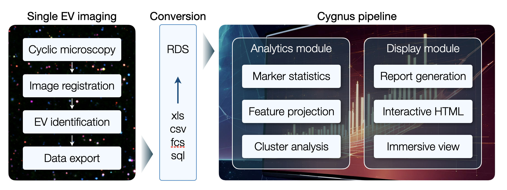

<p align="center"></a></p>
<hr>

# Cygnus Version 1.0.0

**Single EV Imaging Data Analysis and Visualization Pipeline**

Cygnus's analytics module offers a customizable and interactive workflow for single EV analysis with multiplexing. It is designed to accommodate multiple input file types (e.g. xls, csv, fcs, sql) to ensure compatibility with a wide range of data sources and experimental modalities. Vignette for Cygnus analysis workflow can be found <a href=https://yeinchung.github.io/Cygnus/articles/examples.html>here</a>. 

<p align="center"></a></p>
<hr>


## Quick Installation of Cygnus

**First, install devtools (for installing GitHub packages) if it isn't already installed:**
``` r
if (!requireNamespace("devtools", quietly = TRUE)) install.packages("devtools")
```

**Then, install BiocManager (for installing bioconductor packages) if it isn't already installed:**
``` r
if (!requireNamespace("BiocManager", quietly = TRUE)) install.packages("BiocManager")
```

**Then, install Cygnus:**
``` r
devtools::install_github("yeinchung/Cygnus", ref="master", repos = BiocManager::repositories())
```
<hr>

## Issues using Cygnus?

Cygnus is currently in __beta__. If you think you have found a bug, please first install the latest version of Cygnus via
``` r
devtools::install_github("yeinchung/Cygnus", ref="master", repos = BiocManager::repositories())
```
If this does not fix your problem, please [report an issue on Github](https://github.com/yeinchung/Cygnus/issues).
